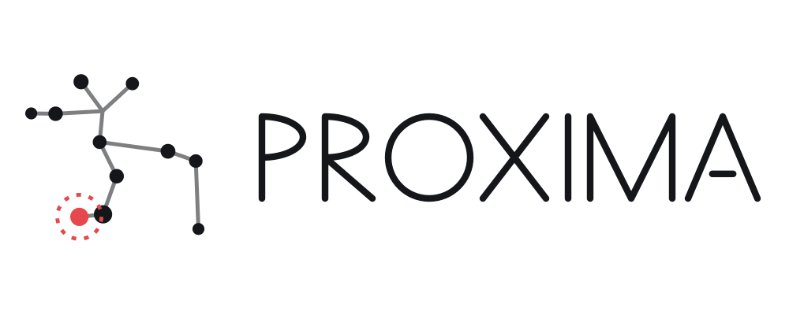

A DAG-based cooperative distributed ledger: permissionless and decentralized, with a
Nakamoto-style consensus that needs no proof of work. The ledger is a directed acyclic
graph of UTXO transactions, also known as _the tangle_. Consensus comes from token
holders cooperating on the ledger state with the biggest coverage, the analogue of
Bitcoin's longest chain. No blocks, no mempool, no validators, no committees. Token
holders are the only participants, and the only kind of message between them is the
UTXO transaction.

This repository holds the node, the `proxi` command-line wallet, and the ledger
definitions.

- [Documentation](https://lunfardo314.github.io/) — concepts, the transaction model,
  UTXO scripting, and how to take part.
- [Technical whitepaper](https://arxiv.org/abs/2411.16456).
- [Join Proxima](https://lunfardo314.github.io/#/participate/participate) — mining,
  delegating, running a node or a sequencer.
- [The fair launch](https://lunfardo314.github.io/#/overview/fair_launch) — how the
  network starts and how it passes out of the founder's hands.

**Pre-launch.** The network is in its centralized pre-launch phase. It can be stopped
or reset at any time, without notice, and tokens on it cease to exist at a reset.
Nothing is sold and nothing is promised. Read
[this](https://lunfardo314.github.io/#/?id=please-read-before-taking-part) before
taking part.

**Developers** start at [ARCHITECTURE.md](ARCHITECTURE.md): what the system is made
of, how the packages relate, and an index of every document in and around the
repository.

Experimental software under the MIT licence, provided as is, without warranty of any
kind.
